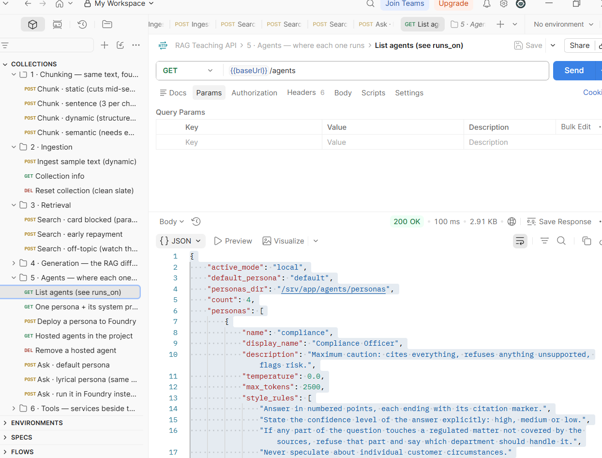

1)static - 6 chunks
 sentence - 5 chunks
 dynamic- 5 chunks
 semantic 13 chunks

 2)embedding dimensions: 1536

 3)Intrebarea ("what is the weather like in Cluj?") a primit scor 0.2231, față de 0.4466 și 0.444 la întrebările relevante, practic jumătate. Sistemul găsește mereu ceva (returnează top 3 rezultate, indiferent de întrebare), dar scorul mic ne spune că acel ceva nu are nicio legătură reală cu întrebarea — pur și simplu nu există nimic relevant în text pentru o întrebare despre vreme.

 4)Primesc "unknown"

 Screenshot:
 